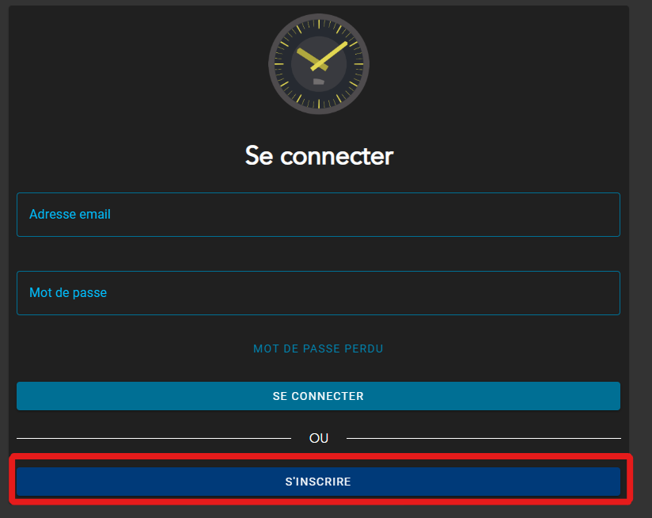
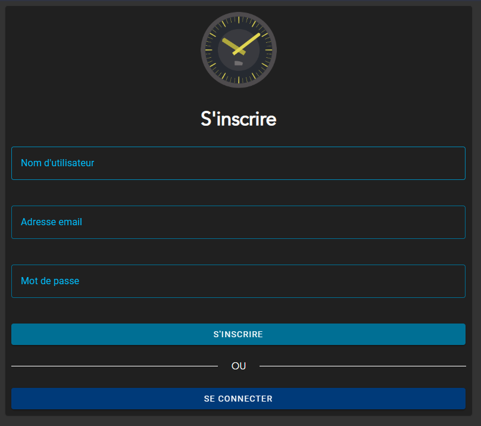
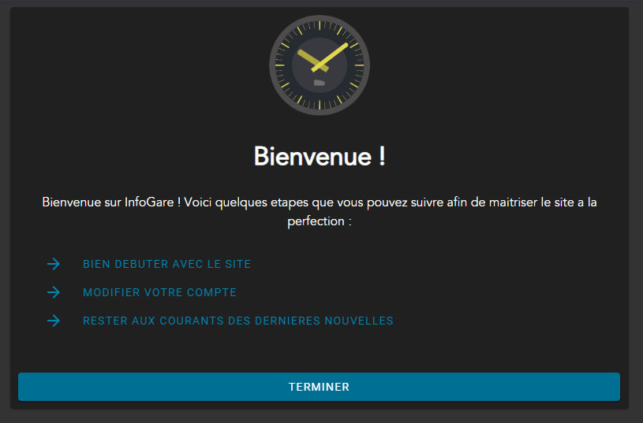

# S'inscrire sur InfoGare

## Pour vous créer un compte :

1. Rendez-vous sur [le site InfoGare](https://www.infogare.fr)  
2. Lorsque la page est chargée, cliquez sur l'icône en haut à droite de la page.

3. Appuyez sur le bouton *S'inscrire*.

4. Remplissez les champs *Nom d'utilisateur*, *Adresse email* et *Mot de passe*, puis validez votre saisie en appuyant sur le bouton *S'inscrire*.

5. Une fois votre inscription terminée, un message de bienvenue avec quelques étapes vous sera affiché. Vous pouvez ignorer les étapes et accéder au site InfoGare en cliquant sur le bouton *Terminer* au bas du formulaire.

 

[Créer une gare >](create-gare#créer-une-gare)