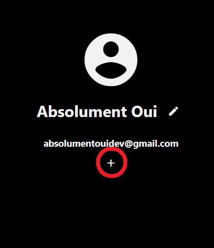
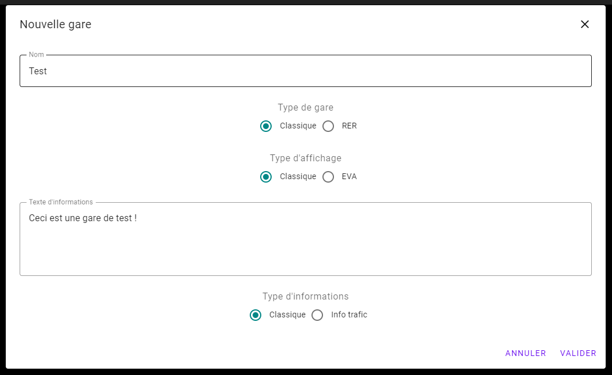
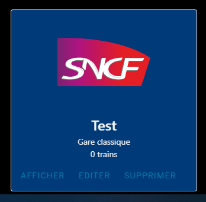

# Créer une gare

## Avant de commencer

Avant de commencer, vous devez avoir effectué les étapes suivantes :

* [Créer un compte](create-account#s39inscrire-sur-infogare)

## Créer une gare

1. Appuyez sur l'icône en forme de bonhomme en haut à droite de la page.

2. Appuyez sur le bouton en forme de *plus* au milieu de la page.

3. Un formulaire s'affiche vous demandant plusieurs informations :
    * Le nom de la gare
    * Le type de gare (classique ou RER)
    * Le type d'affichage (classique ou EVA)
    * Le texte d'informations
    * Le type d'informations

4. Une fois le formulaire rempli, appuyez sur *Valider* pour valider les informations et créer la gare.

5. Une fois la gare créée, la page va se recharger automatiquement et vous devrez voir votre gare apparaître dans la liste.

 

[< Créer un compte](create-account#s39inscrire-sur-infogare) | [Créer une un train >](create-train#créer-un-train)
