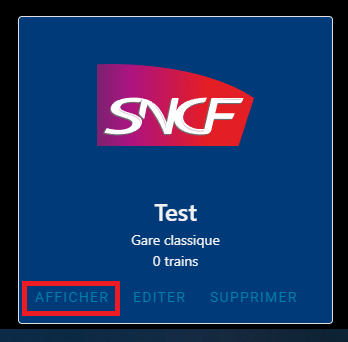
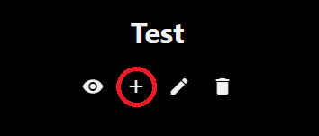
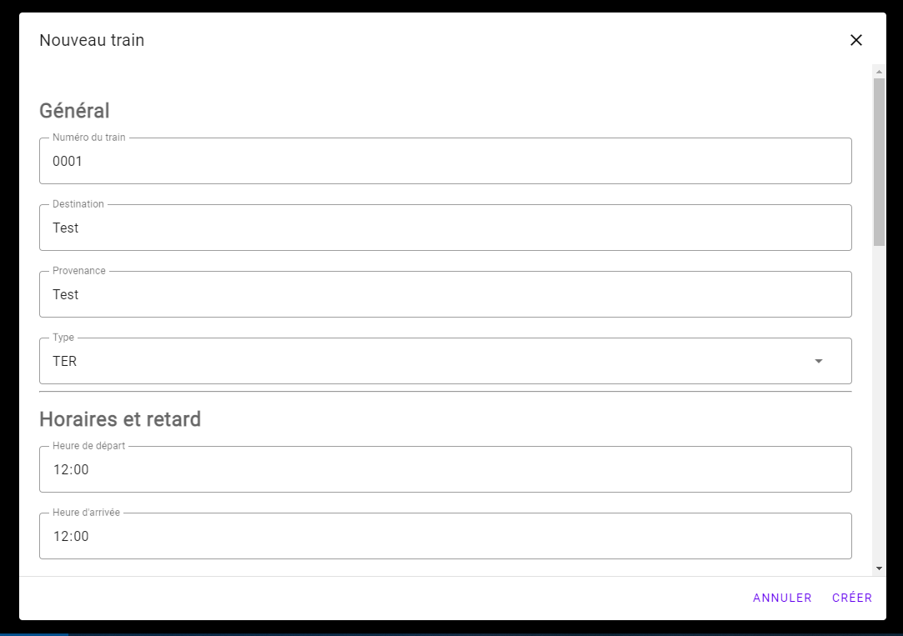
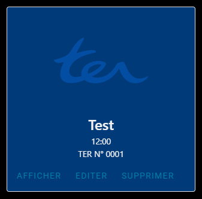

# Créer un train

## Avant de commencer : 

Avant de commencer, vous devez avoir effectué les étapes suivantes :

* [Créer un compte](create-account#s39inscrire-sur-infogare)
* [Créer une gare](create-gare#créer-une-gare)

## Créer un train

1. Appuyez sur le bouton *Afficher* de votre gare pour afficher la liste des trains.

2. Une page vide apparaît. Appuyez sur le bouton en forme de *plus* en dessous du nom de votre gare.

3. Un formulaire apparaît. Remplissez les informations du train, puis validez avec le bouton *Créer* en bas de ce dernier.

4. La page va se recharger et afficher votre train.

