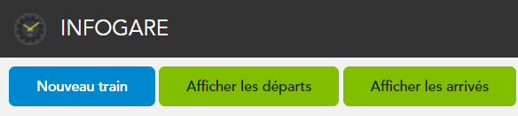
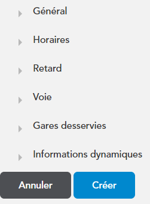

# Créer une gare

## Avant de commencer : 

Avant de commencer, vous devez avoir effectué les étapes suivantes :

* [Créer un compte](create-account)
* [Créer une gare](create-gare)

## Créer un train

1. Appuyez sur votre nom d'utilisateur en haut à droite de la page, puis appuyez sur *Mes gares*.

2. Ensuite, rendez-vous dans la gare souhaité, puis cliquez sur *Nouveau Train*, une pop-up s'affiche

3. Enfin, remplissez ensuite les informations sur le train en clquant sur chaque flèches, puis cliquez sur "Créer"

