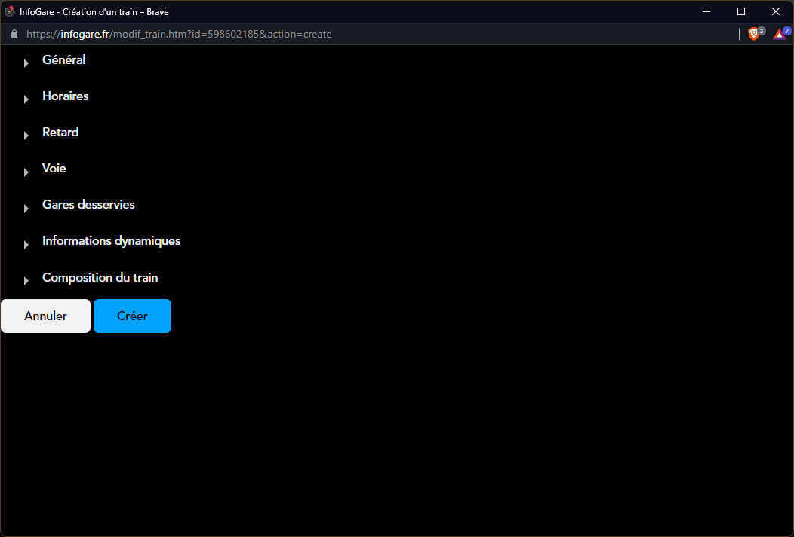
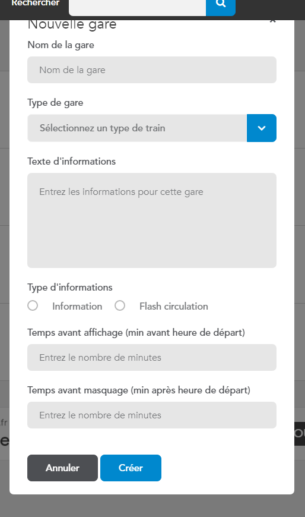
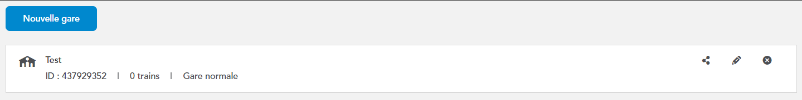

# Créer une gare

## Avant de commencer : 

Avant de commencer, vous devez avoir effectué les étapes suivantes : 
- S'inscrire/se connecter

## Se rendre sur la page des gares

Appuyez sur votre nom d'utilisateur en haut à droite de la page, puis appuyez sur *Mes gares*.

## Créer une gare

1. Appuyez sur le bouton *Créer une gare* en haut à gauche du cadre.

2. Un formulaire s'affiche vous demandant plusieurs informations : 
    - Le nom de la gare
    - Le type de gare (normale ou RER)
    - Le texte d'informations
    - Le type d'informations
    - Le temps d'attente avant l'affichage du train
    - Le temps d'attente avant le masquage du train

3. Une fois le formulaire rempli, appuyez sur *Créer* pour valider les informations et créer la gare.

4. Une fois la gare créée, la page va se recharger automatiquement et vous devrez voir votre gare apparâitre dans la liste. SI ce n'est pas le cas, veuillez vous référer au [référentiel des erreurs](/reference/errors/gare).

